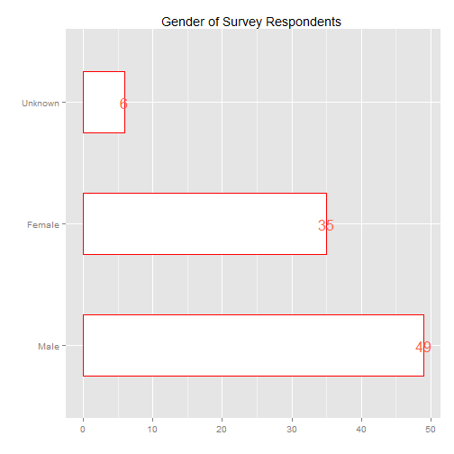
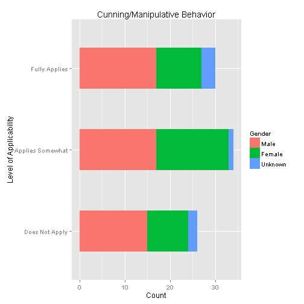
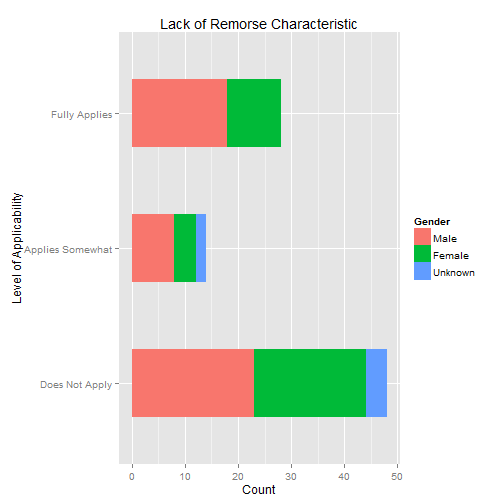
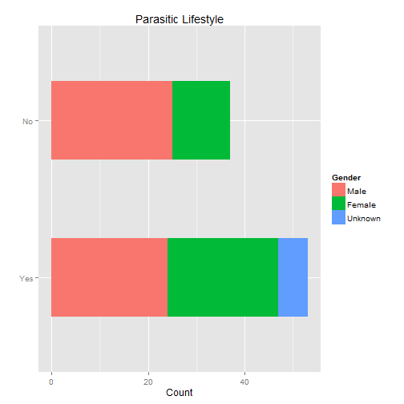
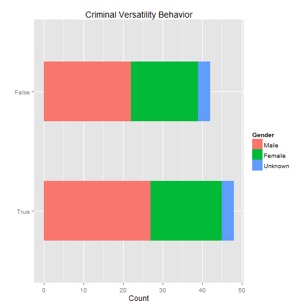
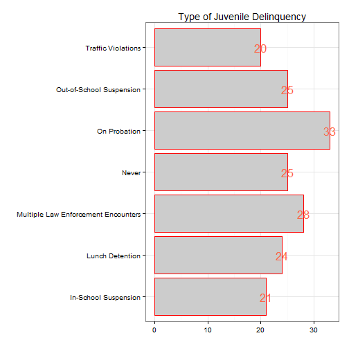
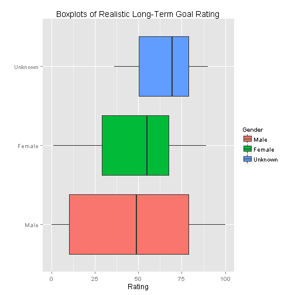
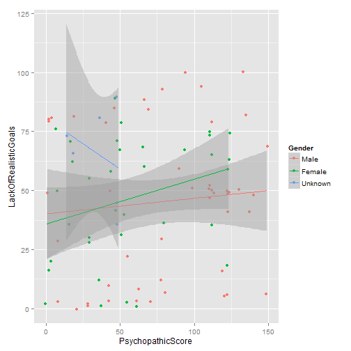

<!-- Specify the report's official name, goal & description. -->
# REDCap Demo
**Report Goal**:  Results of Demo Psychopathic Tendencies Survey
**Report Description**: Results of this survey are not real.  This was only a demo.

<!-- Point knitr to the underlying code file so it knows where to look for the chunks. -->

<!-- Load the packages.  Suppress the output when loading packages. --> 

<!-- Load any Global Functions declared in the R file.  Suppress the output. --> 

<!-- Declare any global functions specific to a Rmd output.  Suppress the output. --> 

<!-- Load the dataset.  Suppress the output. -->

### Gender of Demo Participants
 

### Self-report of Psychopathic Behaviors
    

### Self-report of Juvenile Delinquency
 

### Self-report on Realistic Long-Term Goals
 

### Self-report on Realistic Long-Term Goals
 

