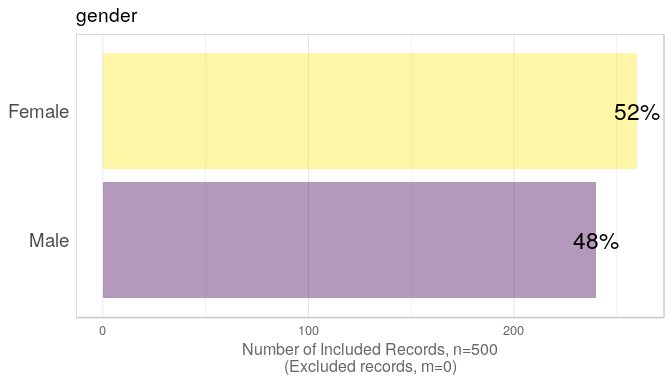
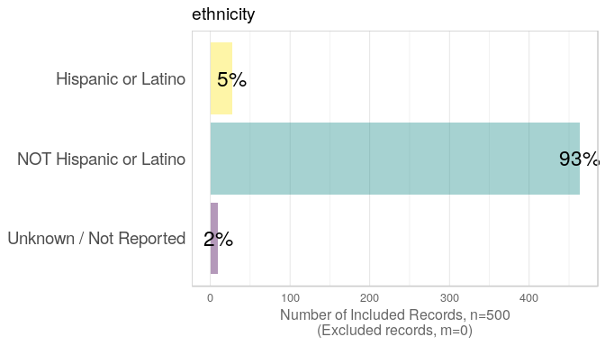
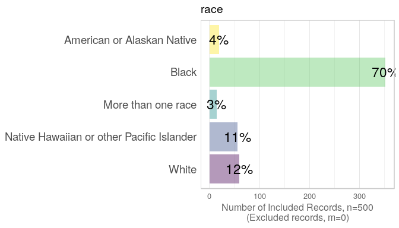

This report covers the analyses used in the ZZZ project (Marcus Mark, PI).

<!--  Set the working directory to the repository's base directory; this assumes the report is nested inside of two directories.-->


<!-- Set the report-wide options, and point to the external code file. -->


<!-- Load 'sourced' R files.  Suppress the output when loading sources. --> 


<!-- Load packages, or at least verify they're available on the local machine.  Suppress the output when loading packages. --> 


<!-- Load any global functions and variables declared in the R file.  Suppress the output. --> 


<!-- Declare any global functions specific to a Rmd output.  Suppress the output. --> 


<!-- Load the datasets.   -->


<!-- Tweak the datasets.   -->


# Summary {.tabset .tabset-fade .tabset-pills}

## Notes 
1. The current report covers 500 patients, with 5 unique values for `race`.
1. The Seattle track's phluguerstometer was producing flaky negative values; it's measurements have been dropped.

## Unanswered Questions
1. What does `VS` stand for?  How was it measured?
1. Where the cars at the Philly track measured with the same phluguerstometer and the Cleveland track?
 
## Answered Questions
1. The Seattle track's phluguerstometer was producing flaky negative values; it's measurements have been dropped.

# Tables

## Gender & Ethnicity
<table class="table table-striped table-hover table-condensed table-responsive" style="width: auto !important; margin-left: auto; margin-right: auto;">
<caption>Enthinicty and Gender Counts</caption>
 <thead>
  <tr>
   <th style="text-align:left;"> ethnicity </th>
   <th style="text-align:right;"> Female </th>
   <th style="text-align:right;"> Male </th>
  </tr>
 </thead>
<tbody>
  <tr>
   <td style="text-align:left;"> Hispanic or Latino </td>
   <td style="text-align:right;"> 19 </td>
   <td style="text-align:right;"> 8 </td>
  </tr>
  <tr>
   <td style="text-align:left;"> NOT Hispanic or Latino </td>
   <td style="text-align:right;"> 237 </td>
   <td style="text-align:right;"> 226 </td>
  </tr>
  <tr>
   <td style="text-align:left;"> Unknown / Not Reported </td>
   <td style="text-align:right;"> 4 </td>
   <td style="text-align:right;"> 6 </td>
  </tr>
</tbody>
</table>

## Gender & Race
<table class="table table-striped table-hover table-condensed table-responsive" style="width: auto !important; margin-left: auto; margin-right: auto;">
<caption>Race and Gender Counts</caption>
 <thead>
  <tr>
   <th style="text-align:left;"> race </th>
   <th style="text-align:right;"> Female </th>
   <th style="text-align:right;"> Male </th>
  </tr>
 </thead>
<tbody>
  <tr>
   <td style="text-align:left;"> American or Alaskan Native </td>
   <td style="text-align:right;"> 9 </td>
   <td style="text-align:right;"> 10 </td>
  </tr>
  <tr>
   <td style="text-align:left;"> Black </td>
   <td style="text-align:right;"> 187 </td>
   <td style="text-align:right;"> 165 </td>
  </tr>
  <tr>
   <td style="text-align:left;"> More than one race </td>
   <td style="text-align:right;"> 7 </td>
   <td style="text-align:right;"> 7 </td>
  </tr>
  <tr>
   <td style="text-align:left;"> Native Hawaiian or other Pacific Islander </td>
   <td style="text-align:right;"> 32 </td>
   <td style="text-align:right;"> 24 </td>
  </tr>
  <tr>
   <td style="text-align:left;"> White </td>
   <td style="text-align:right;"> 25 </td>
   <td style="text-align:right;"> 34 </td>
  </tr>
</tbody>
</table>

# Graphs

## Marginals
<!-- --><!-- --><!-- -->


# Session Information
For the sake of documentation and reproducibility, the current report was rendered in the following environment.  Click the line below to expand.

<details>
  <summary>Environment <span class="glyphicon glyphicon-plus-sign"></span></summary>

```
Session info --------------------------------------------------------------------------------------
```

```
 setting  value                       
 version  R version 3.5.1 (2018-07-02)
 system   x86_64, linux-gnu           
 ui       X11                         
 language (EN)                        
 collate  en_US.UTF-8                 
 tz       America/Chicago             
 date     2018-08-27                  
```

```
Packages ------------------------------------------------------------------------------------------
```

```
 package         * version     date       source                                  
 assertthat        0.2.0       2017-04-11 CRAN (R 3.5.1)                          
 backports         1.1.2       2017-12-13 CRAN (R 3.5.1)                          
 base            * 3.5.1       2018-07-03 local                                   
 bindr             0.1.1       2018-03-13 CRAN (R 3.5.1)                          
 bindrcpp        * 0.2.2       2018-03-29 CRAN (R 3.5.1)                          
 checkmate         1.8.9-9000  2018-08-18 Github (mllg/checkmate@bd7d200)         
 colorspace        1.3-2       2016-12-14 CRAN (R 3.5.1)                          
 compiler          3.5.1       2018-07-03 local                                   
 crayon            1.3.4       2017-09-16 CRAN (R 3.5.1)                          
 curl              3.2         2018-03-28 CRAN (R 3.5.1)                          
 datasets        * 3.5.1       2018-07-03 local                                   
 devtools          1.13.6      2018-06-27 CRAN (R 3.5.1)                          
 digest            0.6.16      2018-08-22 CRAN (R 3.5.1)                          
 dplyr             0.7.6       2018-06-29 CRAN (R 3.5.1)                          
 evaluate          0.11        2018-07-17 CRAN (R 3.5.1)                          
 ggplot2         * 3.0.0       2018-07-03 CRAN (R 3.5.1)                          
 glue              1.3.0       2018-07-17 CRAN (R 3.5.1)                          
 graphics        * 3.5.1       2018-07-03 local                                   
 grDevices       * 3.5.1       2018-07-03 local                                   
 grid              3.5.1       2018-07-03 local                                   
 gtable            0.2.0       2016-02-26 CRAN (R 3.5.1)                          
 highr             0.7         2018-06-09 CRAN (R 3.5.1)                          
 hms               0.4.2.9001  2018-08-18 Github (tidyverse/hms@979286f)          
 htmltools         0.3.6       2017-04-28 CRAN (R 3.5.1)                          
 httr              1.3.1       2017-08-20 CRAN (R 3.5.1)                          
 kableExtra        0.9.0       2018-05-21 CRAN (R 3.5.1)                          
 knitr           * 1.20        2018-02-20 CRAN (R 3.5.1)                          
 labeling          0.3         2014-08-23 CRAN (R 3.5.1)                          
 lazyeval          0.2.1       2017-10-29 CRAN (R 3.5.1)                          
 magrittr        * 1.5         2014-11-22 CRAN (R 3.5.1)                          
 memoise           1.1.0       2017-04-21 CRAN (R 3.5.1)                          
 methods         * 3.5.1       2018-07-03 local                                   
 munsell           0.5.0       2018-06-12 CRAN (R 3.5.1)                          
 pillar            1.3.0       2018-07-14 CRAN (R 3.5.1)                          
 pkgconfig         2.0.2       2018-08-16 CRAN (R 3.5.1)                          
 plyr              1.8.4       2016-06-08 CRAN (R 3.5.1)                          
 purrr             0.2.5       2018-05-29 CRAN (R 3.5.1)                          
 R6                2.2.2       2017-06-17 CRAN (R 3.5.1)                          
 Rcpp              0.12.18     2018-07-23 CRAN (R 3.5.1)                          
 readr             1.2.0       2018-08-18 Github (tidyverse/readr@4b2e93a)        
 REDCapR           0.9.10.9001 2018-08-18 Github (OuhscBbmc/REDCapR@23b1dd4)      
 rlang             0.2.2       2018-08-16 CRAN (R 3.5.1)                          
 rmarkdown         1.10        2018-06-11 CRAN (R 3.5.1)                          
 rprojroot         1.3-2       2018-01-03 CRAN (R 3.5.1)                          
 rstudioapi        0.7         2017-09-07 CRAN (R 3.5.1)                          
 rvest             0.3.2       2016-06-17 CRAN (R 3.5.1)                          
 scales            1.0.0       2018-08-09 CRAN (R 3.5.1)                          
 stats           * 3.5.1       2018-07-03 local                                   
 stringi           1.2.4       2018-07-20 CRAN (R 3.5.1)                          
 stringr           1.3.1       2018-05-10 CRAN (R 3.5.1)                          
 TabularManifest   0.1-16.9003 2018-08-18 Github (Melinae/TabularManifest@4cbc21c)
 testit            0.8         2018-06-14 cran (@0.8)                             
 tibble            1.4.2       2018-01-22 CRAN (R 3.5.1)                          
 tidyr             0.8.1       2018-05-18 CRAN (R 3.5.1)                          
 tidyselect        0.2.4       2018-02-26 CRAN (R 3.5.1)                          
 tools             3.5.1       2018-07-03 local                                   
 utils           * 3.5.1       2018-07-03 local                                   
 viridisLite       0.3.0       2018-02-01 CRAN (R 3.5.1)                          
 withr             2.1.2       2018-03-15 CRAN (R 3.5.1)                          
 xml2              1.2.0       2018-01-24 cran (@1.2.0)                           
 yaml              2.2.0       2018-07-25 CRAN (R 3.5.1)                          
```
</details>


Report rendered by wibeasley at 2018-08-27, 08:52 -0500 in 11 seconds.

