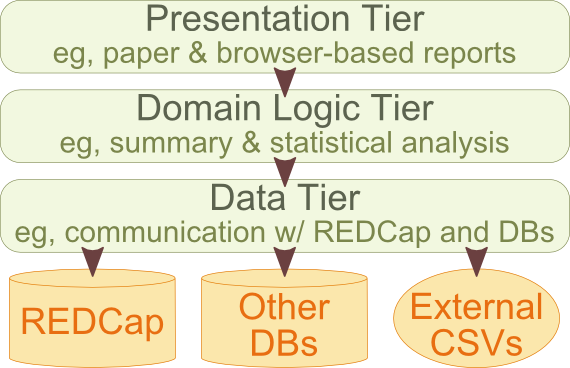
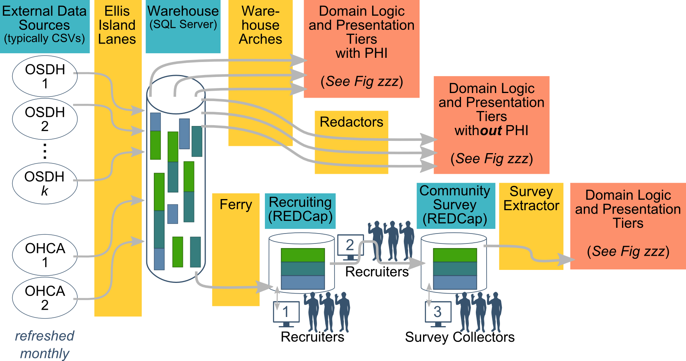

Patterns
=========================

Here are patterns discussed in the article, and links to more complete documentation

### Data Tier

| Pattern | Description |
|:---|:----|
[Extractor](extractor.md) | Exports through the REDCap API into R, and lightly manipulates data |
[Ellis](ellis.md) | Reads data from external agencies; only validated data is allowed entry into our warehouse |
[Ferry](ferry.md) | Moves data from the warehouse (in SQL Server) to REDCap |
[Arch](arch.md) | Exports warehouse data (not REDCap data) to R and lightly munge |
[Redactor](redactor.md) | Removes patient-identifying information from a dataset |
[Record Set](record_set.md) | Removes patient-identifying information from a dataset |

------

### Domain Logic Tier

| Pattern | Description |
|:---|:----|
[Code Behind](code_behind.md) | R file that can specify tables, graphs, or statistical models |
Expensive Model | Executes a long-running model, and caches the results to be consumed later |

------

### Presentation Tier

| Pattern | Description |
|:---|:----|
[Exploratory Markdown Report](markdown_report_exploratory.md) | Rmd file that's interpreted by `knitr` to produce a Markdown document, that's eventually becomes an HTML document |
[Polished LaTeX Report](latex_report_polished.md) | Rnw file that's interpreted by `knitr` to produce a LaTeX document, that's eventually becomes an PDF document |
[(knitr common)](knitr_common.md) | Features Common to all knitr files/patterns |

------

**Figure A: Relationship between the Tiers**

------

**Figure B: Examples of Data Tier Patterns**

